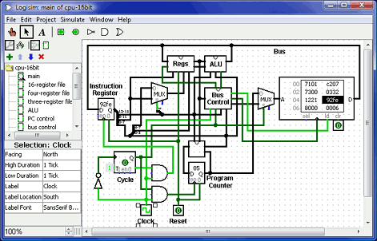

 +
 *Screen shot of Logisim 2.7.0*

*Latest release:* _Logisim 2.7.0 is now available._
[link:announce.html[Full announcement] and link:history.html[change
log]] (7 March 2011)

*Upcoming event:* link:announce.html#sigcse[Discussion on Logisim's
future] on March 10 at http://http://www.sigcse.org/sigcse2011/[SIGCSE]
(24 January 2011)

*Update:* Logisim user Ben Oztalay has graciously provided a library of
7400 chips. [link:links.html[Download]] (11 February 2011)

*https://sourceforge.net/projects/circuit/forums/forum/479543/topic/3847665[About
Logisim's development - and how you can help!]*

Logisim is an educational tool for designing and simulating digital
logic circuits. With its simple toolbar interface and simulation of
circuits as you build them, it is simple enough to facilitate learning
the most basic concepts related to logic circuits. With the capacity to
build larger circuits from smaller subcircuits, and to draw bundles of
wires with a single mouse drag, Logisim can be used (and is used) to
design and simulate entire CPUs for educational purposes.

Logisim is used by students at link:usage.html[colleges and universities
around the world] in many types of classes, ranging from a brief unit on
logic in general-education computer science surveys, to computer
organization courses, to full-semester courses on computer architecture.

link:download[Download Logisim]!

Features
~~~~~~~~

* It is free! (Logisim is open-source (link:gpl.html[GPL]).)
* It runs on _any_ machine supporting Java 5 or later; special versions
are released for MacOS X and Windows. The cross-platform nature is
important for students who have a variety of home/dorm computer systems.
* The drawing interface is based on an intuitive toolbar. Color-coded
wires aid in simulating and debugging a circuit.
* The wiring tool draws horizontal and vertical wires, automatically
connecting to components and to other wires. It's very easy to draw
circuits!
* Completed circuits can be saved into a file, exported to a GIF file,
or printed on a printer.
* Circuit layouts can be used as "subcircuits" of other circuits,
allowing for hierarchical circuit design.
* Included circuit components include inputs and outputs, gates,
multiplexers, arithmetic circuits, flip-flops, and RAM memory.
* The included "combinational analysis" module allows for conversion
between circuits, truth tables, and Boolean expressions.

